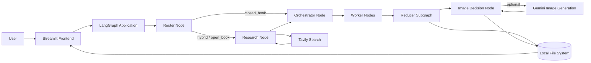
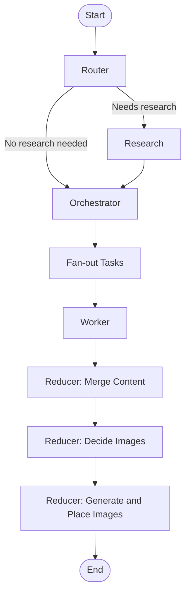
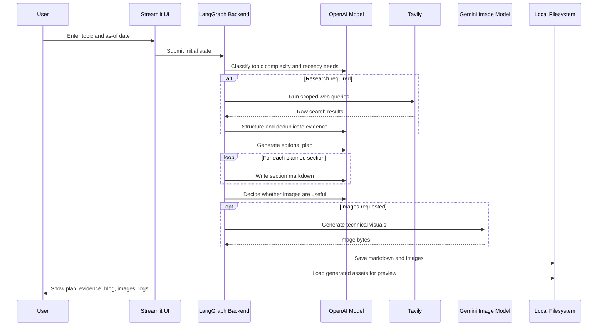

# Blog Writing Agent Application

> A local AI-assisted technical blogging system that transforms a topic into a structured Markdown article, optionally grounded in live web research and enriched with generated technical visuals.

## Executive Overview
This project is a compact, local-first blog generation application built around a LangGraph workflow and exposed through a Streamlit user interface. The system accepts a topic and an "as-of" date, decides whether live research is necessary, builds an editorial plan, writes the article section by section, optionally inserts technical diagrams or illustrative images, and saves the final blog as Markdown.

The current implementation is best understood as an intelligent content generation prototype with a strong architectural core. It already demonstrates multi-step orchestration, structured planning, evidence-aware writing, optional image generation, and a usable frontend for author interaction. At the same time, it remains a local application rather than a productionized platform, which makes it a good base for future scaling, deployment, and workflow hardening.

## Project Objective
The primary objective of this project is to reduce the effort and turnaround time required to produce high-quality technical blog posts while preserving structure, topical relevance, and grounded reasoning.

More specifically, the system is designed to:

- Convert an idea or blog topic into a coherent long-form technical article.
- Distinguish between evergreen topics and topics that need current web evidence.
- Generate a structured editorial plan before writing, rather than producing unstructured long-form text in a single step.
- Use evidence selectively for recency-sensitive or citation-heavy content.
- Create visual aids only when they materially improve understanding.
- Offer a lightweight human-facing interface for generation, preview, download, and reuse of past outputs.

## Problem Statement
Technical blog writing often requires several separate activities:

- Clarifying the angle and audience.
- Deciding whether current information is required.
- Researching relevant sources.
- Creating a usable outline.
- Writing multiple sections consistently.
- Adding diagrams or visuals.
- Packaging the final article for publishing.

This project brings those steps into a single orchestrated flow. Instead of prompting a model once and hoping for a strong result, it decomposes the work into specialized nodes that each perform a well-defined responsibility.

## Solution Summary
At a high level, the application works as follows:

1. The user enters a topic and a reference date in the Streamlit interface.
2. A LangGraph router decides whether the topic can be handled as an evergreen article or requires live research.
3. If research is needed, Tavily search results are collected and distilled into structured evidence.
4. A planning node creates a blog plan with section-level tasks.
5. Worker nodes generate article sections from the plan.
6. A reducer assembles the article into a single Markdown document.
7. An image planning stage determines whether diagrams or technical visuals are useful.
8. If approved by the plan, images are generated and embedded into the Markdown.
9. The final blog and related assets are written to disk and made available for preview and download.

## Architecture Overview
The architecture is organized around a clear separation of concerns:

- `bwa_frontend.py` handles user interaction, progress display, previews, and download actions.
- `bwa_backend.py` contains the full orchestration graph, state model, research flow, writing logic, and image generation pipeline.
- Notebook files capture the iterative evolution of the system from a basic writer to a research-aware and image-capable workflow.

### High-Level Component Diagram


### LangGraph Execution Flow


### End-to-End Runtime Sequence


## Core Workflow in Detail
### 1. Topic Intake
The Streamlit frontend collects:

- A blog topic.
- An "as-of" date that determines the time horizon for research-sensitive content.

This date is significant because the backend uses it to control recency expectations for evidence-driven content.

### 2. Routing and Research Decision
The backend begins with a routing node that classifies the request into one of three modes:

- `closed_book`: evergreen topics that can be handled without live research.
- `hybrid`: largely evergreen topics that still benefit from fresh examples, tools, or references.
- `open_book`: time-sensitive topics such as news, updates, trends, or weekly roundups.

The routing decision also assigns a recency window:

- `closed_book`: very broad historical tolerance.
- `hybrid`: moderate recency window.
- `open_book`: short recency window focused on recent developments.

### 3. Research and Evidence Synthesis
If research is required, the backend:

- Generates high-signal search queries.
- Uses Tavily to fetch web results.
- Converts raw search output into structured `EvidenceItem` objects.
- Deduplicates evidence by URL.
- Filters open-book evidence by date to keep the final article aligned with the requested time window.

This is an important design choice: research is not directly pasted into the output. It is normalized first, then handed to later stages as structured evidence.

### 4. Editorial Planning
The orchestrator creates a structured `Plan` object that includes:

- Blog title.
- Intended audience.
- Tone.
- Blog type.
- Editorial constraints.
- A sequence of section-level writing tasks.

Each task contains:

- A section title.
- A goal.
- Supporting bullet points.
- A target word count.
- Flags for research usage, citations, and code inclusion.

This planning step gives the project a strong editorial backbone and makes the writing stage more predictable and controllable.

### 5. Parallelized Section Writing
The graph fans out planned tasks to worker nodes. Each worker:

- Receives one task.
- Gets access to the plan context.
- Uses evidence only when required.
- Produces a single Markdown section beginning with a second-level heading.

This task-based design makes the system more modular than a one-shot generation pipeline and creates a cleaner path for future parallelization, retries, or quality checks.

### 6. Reducer and Final Markdown Assembly
After all sections are written, a reducer subgraph:

- Sorts sections in task order.
- Merges them into a single article.
- Adds the top-level article heading.

This is the point where the system transitions from section outputs into a publication-oriented asset.

### 7. Image Planning and Generation
The reducer then decides whether visual elements are needed. If so, it:

- Inserts placeholders such as `[[IMAGE_1]]`.
- Creates an image plan with filename, alt text, caption, prompt, size, and quality.
- Generates image bytes through Gemini.
- Writes image assets into the `images/` directory.
- Replaces placeholders in the Markdown with local image links and captions.

The implementation explicitly limits images to those that materially improve understanding and avoids decorative visuals.

### 8. File Output and Retrieval
The final stage writes:

- A Markdown file named from the slugified blog title.
- Optional images inside an `images/` folder.

The frontend then allows the user to:

- Preview the Markdown.
- Render local images.
- Download the Markdown alone.
- Download a bundle containing Markdown and images.
- Load previously saved Markdown blogs from the working directory.

## Repository Structure
```text
blog_writing_agentic_ai/
├── README.md
└── blog-writing-agent/
    ├── bwa_backend.py
    ├── bwa_frontend.py
    ├── 1_bwa_basic.ipynb
    ├── 2_bwa_improved_prompting.ipynb
    ├── 3_bwa_research.ipynb
    ├── 4_bwa_research_fine_tuned.ipynb
    ├── 5_bwa_image.ipynb
    └── tavily_test.ipynb
```

## Module-by-Module Breakdown
### `blog-writing-agent/bwa_backend.py`
This is the core application engine. It defines:

- Pydantic schemas for plans, tasks, evidence, routing decisions, and image specs.
- The LangGraph state model.
- The router node.
- The Tavily-based research node.
- The orchestrator node for blog planning.
- The worker node for section generation.
- The reducer subgraph for content merge and image handling.
- Final file output logic for Markdown and images.

This file is the heart of the application's business logic and orchestration.

### `blog-writing-agent/bwa_frontend.py`
This file contains the Streamlit user interface. It is responsible for:

- Collecting topic and date inputs.
- Invoking or streaming graph execution.
- Displaying plan and evidence outputs.
- Rendering the final Markdown with local images.
- Packaging generated outputs into downloadable ZIP bundles.
- Loading previously created Markdown files from disk.
- Presenting simple runtime logs to the user.

### Notebook Files
The notebook sequence documents the evolution of the project:

- `1_bwa_basic.ipynb`: initial blog-writing workflow.
- `2_bwa_improved_prompting.ipynb`: prompt refinement and quality improvements.
- `3_bwa_research.ipynb`: addition of a research-aware flow.
- `4_bwa_research_fine_tuned.ipynb`: refinement of the research pipeline.
- `5_bwa_image.ipynb`: image planning and generation enhancements.
- `tavily_test.ipynb`: exploratory validation of Tavily-based retrieval.

These notebooks are valuable from an experimentation and learning perspective, even though the Python modules are the actual application runtime.

## Technical Design Principles
Several solid engineering principles are visible in the current implementation:

- **Decision before generation**: the system first decides whether research is needed rather than always researching.
- **Structured outputs over free-form text**: planning, evidence, and image instructions are modeled as schemas.
- **Task decomposition**: the article is split into multiple manageable sections.
- **Grounded generation**: evidence-backed content is constrained to known URLs where appropriate.
- **Selective multimodality**: images are only created when they improve understanding.
- **Local-first output management**: generated artifacts remain on the local filesystem for easy inspection.

## Tech Stack
The current stack is inferred directly from imports and runtime code:

### Language and Runtime
- Python

### User Interface
- Streamlit
- Pandas

### Orchestration and Agent Workflow
- LangGraph

### LLM Integration
- LangChain OpenAI
- LangChain Core message primitives

### Data Modeling and Validation
- Pydantic

### Environment and Configuration
- `python-dotenv`

### Research and Retrieval
- Tavily search through `langchain_community`

### Image Generation
- Google GenAI SDK
- Gemini `gemini-2.5-flash-image`

### Default Models Used in the Current Code
- `gpt-4.1-mini` for routing, planning, writing, evidence synthesis, and image planning
- `gemini-2.5-flash-image` for optional image generation

## Functional Capabilities
The current implementation supports the following capabilities:

- Topic-based technical article generation.
- Recency-aware routing for evergreen versus current-topic content.
- Optional evidence collection and normalization.
- Structured editorial planning.
- Section-based article writing.
- Citation-aware generation for research-backed tasks.
- Optional technical image planning and generation.
- Local Markdown preview with image rendering.
- Downloadable Markdown and bundled assets.
- Loading of previously saved blogs.

## Data and State Model
The LangGraph state includes the following conceptual fields:

- Topic metadata.
- Routing mode and research decision.
- Generated search queries.
- Structured evidence items.
- Blog plan.
- Recency parameters.
- Generated section outputs.
- Merged Markdown.
- Image placeholders and image specs.
- Final rendered Markdown.

This state-centric approach is useful because it creates a clean interface between orchestration stages and makes future observability or persistence upgrades easier.

## External Dependencies and Configuration
The application depends on external APIs and keys.

### Required
- `OPENAI_API_KEY`

This is required because the backend uses `ChatOpenAI`.

### Optional but Important
- `TAVILY_API_KEY`
- `GOOGLE_API_KEY`

If these are missing:

- Research functionality may be skipped or produce no evidence.
- Image generation may fail gracefully and leave a descriptive fallback block inside the Markdown instead of a generated image.

### Example `.env`
```env
OPENAI_API_KEY=your_openai_key_here
TAVILY_API_KEY=your_tavily_key_here
GOOGLE_API_KEY=your_google_key_here
```

## Local Setup
This repository does not currently include a dependency lockfile or packaging metadata such as `requirements.txt` or `pyproject.toml`. The setup below is therefore based on the actual imported libraries in the source code.

### 1. Create a virtual environment
On Windows PowerShell:

```powershell
python -m venv .venv
.venv\Scripts\Activate.ps1
```

On macOS or Linux:

```bash
python -m venv .venv
source .venv/bin/activate
```

### 2. Install inferred dependencies
```bash
pip install streamlit pandas langgraph langchain-openai langchain-core pydantic python-dotenv langchain-community google-genai
```

### 3. Add environment variables
Create a `.env` file in the project or execution directory with the required API keys.

### 4. Launch the application
Because the application reads and writes files using relative paths, it is best to launch it from inside the `blog-writing-agent/` directory.

```bash
cd blog-writing-agent
streamlit run bwa_frontend.py
```

## How to Use the Application
1. Start the Streamlit app.
2. Enter a topic in the sidebar.
3. Select the relevant "as-of" date.
4. Click the generate button.
5. Watch graph progress through the logs and status updates.
6. Review the plan, evidence, generated article, and images in the tabs.
7. Download the final Markdown or the bundled Markdown-plus-images package.

## Outputs Generated by the System
When a run completes, the system can generate:

- A Markdown file named after the blog title.
- An `images/` folder containing generated image assets.
- A ZIP bundle containing the Markdown and images.

This makes the output convenient for local review, handoff, or downstream publishing workflows.

## Current Strengths
From an architecture and prototyping standpoint, this project already demonstrates several strengths:

- Clean decomposition of the writing lifecycle into explicit graph nodes.
- Use of structured schemas instead of relying entirely on raw prompt text.
- Clear distinction between evergreen writing and research-backed writing.
- A practical UI that exposes intermediate outputs rather than only the final article.
- Graceful handling of optional capabilities such as research and image generation.
- Strong extensibility for adding review, evaluation, storage, or publishing nodes later.

## Current Limitations
The current codebase also has several limitations that are important to document clearly:

- There is no dependency manifest or lockfile.
- There is no automated test suite.
- There is no containerization or deployment configuration.
- Output persistence is local filesystem based, with no database or object storage abstraction.
- The application appears intended for single-user local execution rather than shared or production use.
- Working-directory behavior matters because blogs and images are read and written using relative paths.
- Prior generated blogs can be loaded as Markdown, but intermediate metadata such as the original plan and evidence are not persisted with those files.
- Observability, tracing, error telemetry, and cost tracking are not yet implemented.
- Security is limited to local environment variable usage; there is no secrets manager, access control, or audit trail.

## Security and Operational Considerations
Before using this application in a broader environment, the following should be considered:

- API keys should be managed securely and never committed to source control.
- Generated content should be reviewed by a human before publication, especially for claims based on external evidence.
- Citation behavior should be validated further for high-stakes technical or policy-sensitive topics.
- Generated images should be reviewed for accuracy, labeling quality, and suitability for publication.
- A production-grade version would need rate-limit handling, retries, structured logging, and possibly caching.

## Future Scope
This project has strong potential for expansion into a more robust AI content platform. A practical future roadmap could include the following areas.

### Product and Workflow Enhancements
- Human approval checkpoints between planning, drafting, and publishing.
- Multi-style output modes for tutorials, explainers, release notes, and executive summaries.
- Richer citation formatting and source quality ranking.
- Built-in editorial review for tone, clarity, factuality, and structure.
- Regenerate-one-section and edit-in-place workflows instead of rerunning the entire graph.

### Platform and Architecture Enhancements
- Add a proper dependency manifest and reproducible environment setup.
- Persist plans, evidence, images, and final blogs in a structured store.
- Add content versioning and run history.
- Support asynchronous jobs and queue-based execution for longer generations.
- Introduce caching for research results and repeated prompts.
- Add model abstraction to support different providers or fallback strategies.

### Productionization and DevOps
- Dockerize the application.
- Add CI pipelines for linting, tests, and packaging.
- Introduce automated regression tests for routing, planning, and file generation.
- Add monitoring, logging, prompt versioning, and usage analytics.
- Integrate secrets management and environment-specific deployment configuration.

### Publishing and Ecosystem Integrations
- Export directly to CMS platforms such as WordPress, Ghost, Notion, or Dev.to.
- Add Git-based publishing workflows.
- Support SEO metadata generation.
- Generate social media snippets, newsletter excerpts, and summary cards from the final article.
- Integrate diagrams with alternative renderers or vector outputs for better publishing quality.

### Intelligence and Quality Improvements
- Add a dedicated review node for fact-checking and style correction.
- Introduce a retrieval memory layer for organization-specific writing guidelines.
- Score outputs with automated quality evaluators.
- Improve source credibility filtering and citation coverage analysis.
- Add more deterministic handling for time-sensitive news and trend articles.

## Recommended Next Evolution
If this project were to move toward an industry-ready implementation, the most logical next milestones would be:

1. Add dependency management and a reproducible setup file.
2. Introduce automated tests around the graph and output contracts.
3. Separate generated artifacts from application source directories.
4. Persist structured run metadata rather than only final Markdown.
5. Add review and approval gates before publication.
6. Containerize and deploy the application behind a managed runtime.

## Conclusion
This repository is a strong example of an agentic content-generation workflow implemented in a simple, understandable way. It already demonstrates real architectural value through routing, evidence-aware generation, structured planning, task fan-out, optional multimodal output, and an accessible user interface.

In its current form, it is best positioned as a local prototype or proof-of-concept for AI-assisted technical blogging. With packaging, testing, persistence, observability, and publishing integrations, it could evolve into a much more mature content operations platform.
