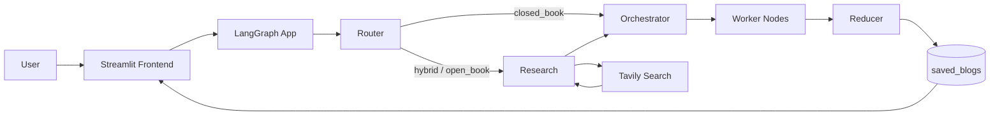
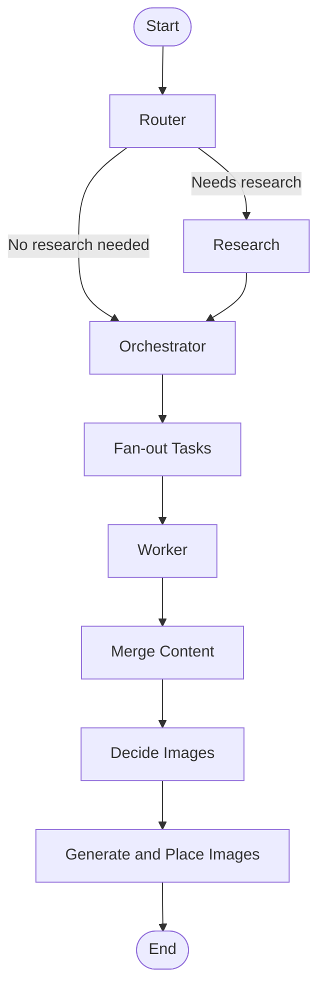
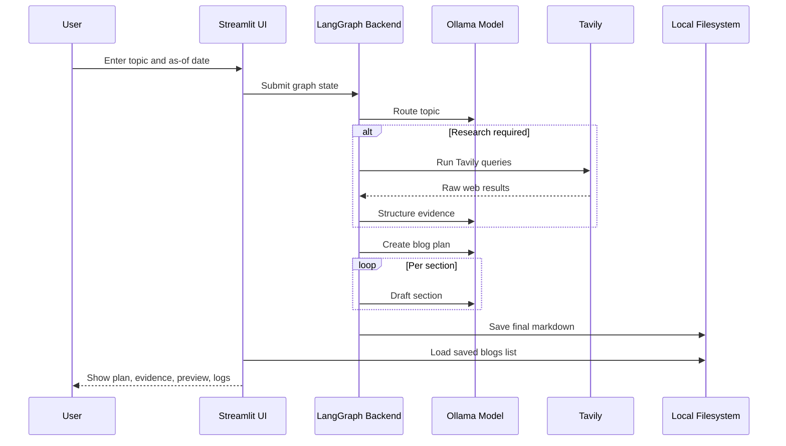

# Blog Writing Agent Application

> A local-first, agentic technical blog generator built with Streamlit, LangGraph, Tavily, and a free local `Ollama` model.

## Executive Overview
This project is an AI-assisted blogging application that takes a topic and an "as-of" date, decides whether live web research is needed, creates a structured editorial plan, writes a blog section by section, and saves the final Markdown article for later reuse.

The current runtime is optimized for **local usage without paid text-model APIs**. The app now uses a local `Ollama` model for text generation, optional Tavily search for web evidence, and saves generated blogs to a dedicated `saved_blogs/` folder that is surfaced inside the Streamlit UI.

## Current Runtime Mode
The repository has evolved from earlier hosted-model experiments into a local-first build with these current defaults:

- **Text generation**: local `Ollama` model via `langchain-ollama`
- **Default text model**: `qwen2.5:1.5b`
- **Research**: optional Tavily search if `TAVILY_API_KEY` is configured
- **Image generation**: disabled by default
- **Saved output location**: `blog-writing-agent/saved_blogs/`

This means the project can generate blogs without OpenAI, Anthropic, or Gemini text quotas, but generation speed depends heavily on your machine's CPU/RAM.

## Project Objective
The goal of the project is to reduce the effort needed to produce structured technical blog posts while preserving:

- topical relevance
- editorial structure
- research grounding when needed
- reproducible local output
- a simple human-friendly workflow

The application is designed to:

- turn a topic into a full technical blog
- distinguish evergreen topics from recency-sensitive topics
- build a plan before drafting
- optionally research the web for current information
- write the blog section by section rather than in one monolithic prompt
- let users review, download, and reload prior blog outputs

## Problem Statement
Technical blog writing usually requires a chain of tasks:

- deciding the angle
- determining whether current information is needed
- finding sources
- creating an outline
- drafting multiple sections consistently
- packaging the result for reuse or publishing

This project combines those steps into a single orchestrated workflow. Instead of using one prompt for the entire article, it uses a multi-stage graph where each node has a specific responsibility.

## Solution Summary
At a high level, the application works like this:

1. The user enters a topic and an as-of date in Streamlit.
2. The router decides whether research is needed.
3. If required, Tavily gathers web results and the app distills them into structured evidence. (Tavily is a real-time web search and data platform designed to provide AI agents and large language models with accurate, structured, and up-to-date information from the web.)
4. The orchestrator creates a blog plan.
5. Worker nodes draft individual sections.
6. The reducer merges sections into a final Markdown article.
7. The final article is written to `saved_blogs/`.
8. The UI shows plan, evidence, preview, logs, and previously saved blogs.

## Architecture Overview
### Main Components
- `bwa_frontend.py`: Streamlit UI, progress display, preview, download actions, and past-blog loading
- `bwa_backend.py`: LangGraph workflow, schemas, routing, research, planning, writing, merge, and final file persistence
- `saved_blogs/`: persistent local storage for generated Markdown articles
- `images/`: optional local image assets when image generation is enabled
- notebooks: project evolution and experimentation history

### High-Level Component Diagram


### LangGraph Execution Flow


### Runtime Sequence


## Core Workflow
### 1. Topic Intake
The user supplies:

- a topic
- an as-of date

The date helps the system reason about how recent the evidence should be.

### 2. Routing
The app classifies the request into one of three modes:

- `closed_book`
- `hybrid`
- `open_book`

This determines whether the app writes from model knowledge alone or performs live research first.

### 3. Research
If research is required, the backend:

- generates search queries
- calls Tavily
- extracts structured evidence items
- deduplicates URLs
- applies recency filtering for time-sensitive topics

### 4. Planning
The orchestrator creates a structured `Plan` with:

- blog title
- audience
- tone
- blog kind
- constraints
- section-level tasks

Each task contains bullets, a goal, target word count, and metadata such as whether research or code is needed.

### 5. Section Writing
The graph fans out tasks to worker nodes. Each worker receives:

- the section task
- the overall plan
- topic metadata
- any evidence

and returns one Markdown section.

### 6. Merge and Save
The reducer:

- orders the sections
- merges them into a full article
- optionally handles images
- writes the final Markdown file to `saved_blogs/`

### 7. Retrieval in the UI
The Streamlit sidebar reads from `saved_blogs/` and lets the user load prior generated articles directly into the app.

## Repository Structure
```text
blog_writing_agentic_ai/
├── .gitignore
├── README.md
├── requirements.txt
└── blog-writing-agent/
    ├── .env
    ├── bwa_backend.py
    ├── bwa_frontend.py
    ├── images/
    ├── saved_blogs/
    ├── 1_bwa_basic.ipynb
    ├── 2_bwa_improved_prompting.ipynb
    ├── 3_bwa_research.ipynb
    ├── 4_bwa_research_fine_tuned.ipynb
    ├── 5_bwa_image.ipynb
    └── tavily_test.ipynb
```

## Module Breakdown
### `blog-writing-agent/bwa_backend.py`
Contains:

- Pydantic schemas
- LangGraph state definition
- routing logic
- Tavily research integration
- blog planning logic
- worker drafting logic
- reducer and save logic
- optional image-generation hooks

### `blog-writing-agent/bwa_frontend.py`
Contains:

- Streamlit page layout
- progress streaming
- plan/evidence/preview/log tabs
- local-image-aware Markdown rendering
- bundle download helpers
- `Past blogs` loading from `saved_blogs/`

### Notebook Files
The notebook sequence shows the historical evolution of the project from a basic writer to research-aware and image-capable versions. The notebooks are useful for experimentation, but the production runtime is the pair of Python files above.

## Tech Stack
### Language and Runtime
- Python

### UI
- Streamlit
- Pandas

### Orchestration
- LangGraph

### Text Generation
- `Ollama`
- `langchain-ollama`
- default model: `qwen2.5:1.5b`

### Data Modeling
- Pydantic

### Research
- Tavily
- `langchain-community`

### Configuration
- `python-dotenv`

### Optional Image Generation
- Google GenAI SDK
- Gemini image model support still exists in code, but is disabled by default

## Current Functional Capabilities
- local text generation with no paid text API dependency
- topic routing
- optional live research
- evidence extraction
- plan generation
- multi-section drafting
- Markdown preview
- download bundle generation
- persistent saved-blog loading from `saved_blogs/`

## Current Configuration
### `.env`
Current relevant environment variables are:

```env
TAVILY_API_KEY=your_tavily_key_here
OLLAMA_TEXT_MODEL=qwen2.5:1.5b
ENABLE_IMAGE_GENERATION=false
```

### Variable Behavior
- `TAVILY_API_KEY`: optional; enables research
- `OLLAMA_TEXT_MODEL`: local model name to use through Ollama
- `ENABLE_IMAGE_GENERATION`: defaults to `false`; when set to `true`, additional image configuration and dependencies are needed

## Local Setup
### 1. Create a virtual environment
Windows PowerShell:

```powershell
python -m venv .venv
.venv\Scripts\Activate.ps1
```

macOS/Linux:

```bash
python -m venv .venv
source .venv/bin/activate
```

### 2. Install Python dependencies
From the repository root:

```bash
pip install -r requirements.txt
```

### 3. Install Ollama
Install Ollama from [ollama.com](https://ollama.com/).

### 4. Pull the local model
```bash
ollama pull qwen2.5:1.5b
```

### 5. Create `.env`
Create `blog-writing-agent/.env`:

```env
TAVILY_API_KEY=your_tavily_key_here
OLLAMA_TEXT_MODEL=qwen2.5:1.5b
ENABLE_IMAGE_GENERATION=false
```

### 6. Run the app
```bash
cd blog-writing-agent
streamlit run bwa_frontend.py
```

## Usage
1. Launch the app.
2. Enter a topic.
3. Select the as-of date.
4. Click `Generate Blog`.
5. Review the generated plan, evidence, preview, and logs.
6. Use the `Past blogs` sidebar to load previously saved content.

## Output Storage
Generated outputs are now persisted as follows:

- final blog Markdown: `blog-writing-agent/saved_blogs/*.md`
- optional images: `blog-writing-agent/images/`

Important note:

- a newly generated blog is saved immediately to `saved_blogs/`
- the `Past blogs` sidebar may need a Streamlit rerun/refresh to reflect a file created during the same execution cycle

## Performance Notes
The current build can feel slow, especially on laptops or CPU-only machines, because:

- the app uses a local model, not a hosted API
- the graph makes multiple model calls per blog
- the orchestrator can create 5 to 9 sections
- each section is drafted independently
- research adds additional external calls and summarization work

This architecture trades speed for modularity and cost control.

## Streamlit Community Cloud Deployment
### Important Constraint
The **current default Ollama-based build will not deploy successfully to Streamlit Community Cloud as-is**.

Why:

- Streamlit Community Cloud does not provide a local Ollama daemon
- it does not come with your downloaded local model
- the app currently expects local model inference for text generation

So if you push the current code unchanged to Streamlit Community Cloud, the app will fail at text generation.

### How to Deploy Without Errors
To deploy this project on Streamlit Community Cloud reliably, you need a **hosted text model provider** instead of local Ollama. In practice, that means creating a cloud-friendly variant of the app that replaces `ChatOllama` with one of:

- OpenAI
- Anthropic
- Gemini
- Groq
- OpenRouter
- another hosted LangChain-supported model provider

Then:

1. update the backend provider code
2. update `requirements.txt` for that provider
3. push the repo to GitHub
4. create a new Streamlit Community Cloud app
5. set the main file to `blog-writing-agent/bwa_frontend.py`
6. add the provider API key as a Streamlit secret
7. optionally add `TAVILY_API_KEY` if you want live research

### Recommended Cloud Deployment Paths
#### Option A: Streamlit Community Cloud
Use this only if you are willing to switch from local Ollama to a hosted provider.

This is the easiest path for public web access, but it reintroduces API dependency and quota concerns.

#### Option B: Self-Hosted Streamlit + Ollama
If you want to keep the current free local-model architecture, the recommended deployment target is:

- a VM
- a VPS
- a local server
- a Docker host you control

where both:

- Streamlit
- Ollama

can run on the same machine.

This is the best match for the current codebase.

### Streamlit Cloud Checklist
If you convert the app to a hosted provider, this is the safe deployment checklist:

1. ensure `requirements.txt` contains only the actual cloud dependencies
2. remove local-only assumptions that require Ollama
3. commit `.gitignore` so `.env` is never pushed
4. add secrets in the Streamlit Cloud dashboard, not in code
5. test locally with the same provider before deployment
6. make sure optional features degrade gracefully when secrets are missing

## Limitations
- no automated test suite yet
- local-model generation is slower than hosted APIs
- `Past blogs` stores only final Markdown, not the full plan/evidence state
- optional image generation is disabled by default
- current default build is local-machine oriented rather than turnkey cloud-native

## Security and Operational Notes
- do not commit `.env`
- rotate any keys that were exposed during testing
- review generated content before publishing
- verify citations for factual or time-sensitive topics
- review any generated visuals before use if image generation is enabled

## Future Scope
### Product Enhancements
- human review checkpoints
- regenerate-one-section workflows
- richer citation formatting
- SEO metadata generation
- publishing/export integrations

### Engineering Enhancements
- provider abstraction for switching between local and hosted models
- faster local mode with fewer sections and smaller prompts
- persistent structured run metadata
- tests for routing, planning, and save behavior
- Docker-based deployment

### Deployment Enhancements
- a dedicated cloud configuration mode
- remote-model support behind environment flags
- containerized Streamlit + Ollama deployment
- production logging and observability

## Conclusion
This repository is now best understood as a **local-first agentic blog-writing system** built around LangGraph orchestration and a free local `Ollama` text model. It demonstrates a strong workflow design, optional research integration, usable persistence, and a practical Streamlit interface.

For local usage, the current architecture is functional and cost-effective. For Streamlit Community Cloud, a hosted model provider must be introduced first; for self-hosted deployments, the current Ollama-based setup is the more natural fit.
